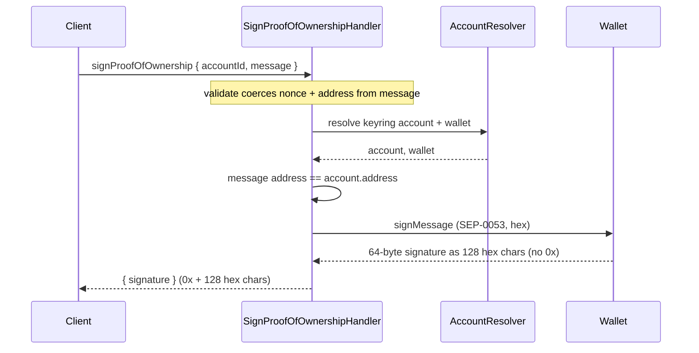

# Use case: `signProofOfOwnership`

Silently signs a proof-of-ownership message so `@metamask/profile-metrics-controller` can prove the user controls a Stellar address.

|            |                                                                                                                 |
| ---------- | --------------------------------------------------------------------------------------------------------------- |
| **Entry**  | `onClientRequest` → `ClientRequestHandler` → `SignProofOfOwnershipHandler`                                      |
| **Method** | `signProofOfOwnership` (`ClientRequestMethod.SignProofOfOwnership`)                                             |
| **Source** | [`handlers/clientRequest/signProofOfOwnership.ts`](../../../src/handlers/clientRequest/signProofOfOwnership.ts) |

This is a **silent sign** — there is no confirmation dialog. That is intentional: the MetaMask client needs an ownership proof without interrupting the user. The method is scoped so it cannot be used as a general sign-message bypass:

1. SIP-31 `onClientRequest` is only callable by the MetaMask client.
2. The plaintext must be `metamask:proof-of-ownership:{nonce}:{address}`, and the embedded address must match the signing account.
3. Signing uses [SEP-0053](https://github.com/stellar/stellar-protocol/blob/master/ecosystem/sep-0053.md) (`Wallet.signMessage`); the response is 0x-prefixed hex for the identity auth API.

## Request / response (shape)

**Request params**

- `accountId` — keyring account UUID
- `message` — plaintext `metamask:proof-of-ownership:{nonce}:{address}` (see [Message format](#message-format))
- `nonce`, `address` — coerced from `message` internally (clients do not send these)

**Response**

- `{ signature }` — SEP-0053 Stellar signed-message ed25519 signature as hex, plus a `0x` prefix for the identity auth API:
  - The raw signature is **64 bytes** → **128** lowercase hex characters (the `0x` prefix is **not** part of those 64 bytes).
  - Wire form: `0x` + 128 hex chars (130 characters total), e.g. validated by `/^0x[0-9a-f]{128}$/`.

## Message format

Parsed by [`parseProofOfOwnershipMessage`](../../../src/handlers/clientRequest/utils.ts) during request validation:

- Prefix must be exactly `metamask:proof-of-ownership:` (case-sensitive).
- `{nonce}` is non-empty and may contain `:` characters; parsing splits on the **last** `:` in the remainder.
- `{address}` must be a valid Stellar strkey (G… public key).

Example: `metamask:proof-of-ownership:ns:abc:123:GBX…` → nonce `ns:abc:123`, address `GBX…`.

## Participants

| Component                     | Path                     | Role in this flow                                    |
| ----------------------------- | ------------------------ | ---------------------------------------------------- |
| `ClientRequestHandler`        | `handlers/clientRequest` | Routes `signProofOfOwnership` to the handler         |
| `SignProofOfOwnershipHandler` | `handlers/clientRequest` | Validates message, resolves wallet, signs            |
| `AccountResolver`             | `handlers/`              | Loads keyring account + wallet (no on-chain account) |
| `AccountService`              | `services/account`       | Keyring account lookup (via resolver)                |
| `WalletService` / `Wallet`    | `services/wallet`        | Signing key material + SEP-0053 `signMessage`        |

No confirmation UI or network calls.

## Step-by-step

1. **Route** — `onClientRequest` dispatches to `SignProofOfOwnershipHandler`.
2. **Validate** — Request must match `SignProofOfOwnershipJsonRpcRequestStruct` (prefix, nonce, Stellar address). `nonce` and `address` are coerced from `message`.
3. **Resolve** — `AccountResolver.resolveAccount` with `RESOLVE_ACCOUNT_KEYRING_AND_WALLET` loads keyring account and wallet only. The signing account does not need to be activated on-chain.
4. **Bind** — The address in the message must equal the signing account address.
5. **Sign** — `Wallet.signMessage(message, 'hex')` returns the 64-byte SEP-0053 signature as 128 hex chars (no `0x`), then the handler prefixes `0x`.

## Sequence (happy path)

