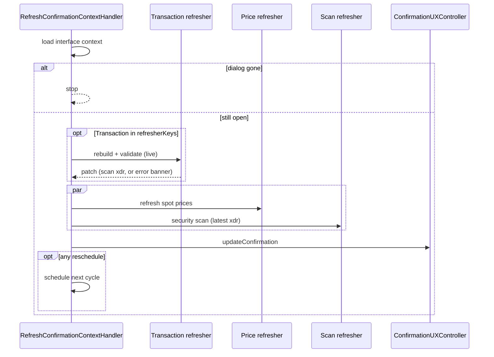

# Use case: `refreshConfirmationContext`

While a confirmation dialog is open, periodically refresh prices, security scan, and/or rebuild the pending transaction against live on-chain state.

|            |                                                                                                             |
| ---------- | ----------------------------------------------------------------------------------------------------------- |
| **Entry**  | `onCronjob` → `CronjobHandler` → `RefreshConfirmationContextHandler`                                        |
| **Method** | `refreshConfirmationContext` (`BackgroundEventMethod.RefreshConfirmationContext`)                           |
| **Source** | [`handlers/cronjob/refreshConfirmationContext/`](../../../src/handlers/cronjob/refreshConfirmationContext/) |
| **Gate**   | Skipped when wallet locked / inactive — see [cronjob.md](./cronjob.md)                                      |

Scheduled by `ConfirmationUXController` when a dialog opens with pricing, security scanning, and/or local simulation enabled (e.g. [`confirmSend`](../client-request/confirmSend.md), [`changeTrustOpt`](../client-request/changeTrustOpt.md)).

## Request params

- `interfaceId` — Snap UI interface id
- `interfaceKey` — which confirmation view
- `scope` — CAIP-2 chain ID
- `refresherKeys` — which slices to run this cycle: `Prices` · `Scan` · `Transaction`

## Participants

| Component                           | Path                                        | Role                                                  |
| ----------------------------------- | ------------------------------------------- | ----------------------------------------------------- |
| `RefreshConfirmationContextHandler` | `handlers/cronjob`                          | Orchestrate refreshers, re-render, reschedule         |
| `ConfirmationPriceRefresher`        | `handlers/cronjob/.../priceRefresher`       | Spot prices via `PriceService`                        |
| `ConfirmationScanRefresher`         | `handlers/cronjob/.../scanRefresher`        | Blockaid / security scan via `TransactionScanService` |
| `ConfirmationTransactionRefresher`  | `handlers/cronjob/.../transactionRefresher` | Rebuild + re-validate pending tx (live account)       |
| `ConfirmationUXController`          | `ui/confirmation`                           | Apply patched context to the open dialog              |

## Refreshers

### Prices

Fetches / updates token spot prices shown on the confirmation (fee asset, send asset, etc.). Requests reschedule while pricing is still needed and not in a terminal error state.

### Security scan

Runs (or refreshes) the remote security scan on `securityScanRequest` in context. Uses the **rebuilt** envelope when the transaction refresher already patched it this cycle.

### Transaction rebuild

Runs **first** when enabled. Rebuilds from the original request against a live on-chain account (fresh fee, sequence, time bounds, destination activation). Confirm-time send / change-trust rebuilds again before signing; this cycle does not patch the stored confirmation `transaction` XDR.

- **Success** — write the rebuilt XDR into `securityScanRequest` so scan does not use a stale snapshot.
- **Hard failure (`halt`)** — set `transactionsFetchStatus` / `scanFetchStatus` to error with a mapped banner message; omit the security scan this cycle; do **not** reschedule further auto-cron cycles. Used for validation errors the user cannot fix in-dialog (balance, trustline, etc.).
- **Recoverable failure (`recoverable`)** — same banner + omit scan this cycle + pause auto-cron, but keep `securityScanRequest` intact (do not null it). Used for SEP-29 `RequiresMemo` so a later UI-triggered refresh (after the user adds a memo) can rebuild and re-scan without reconstructing the scan request. Distinct from `halt`: soft-fail intended to be resumed by the UI, not a permanent hard-stop signal.

## Step-by-step (one cycle)

1. Resolve enabled refreshers from `refresherKeys`.
2. Load interface context; if the dialog was dismissed → stop (no reschedule).
3. Run **transaction** refresher alone (if selected), merge its patch.
4. Run **prices** and **scan** in parallel on the updated context (scan is omitted when the transaction refresher returned `halt` or `recoverable`).
5. Merge patches → `ConfirmationUXController.updateConfirmation`.
6. If any refresher **halt**ed or returned **recoverable** → stop (no auto-reschedule). Otherwise if any refresher asks to **reschedule** → schedule the next `refreshConfirmationContext` event.

## Sequence

