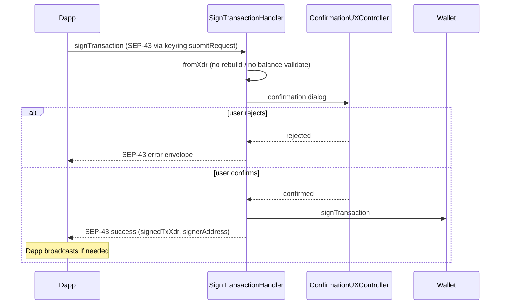

# Use case: `signTransaction`

SEP-43: show a confirmation, then return a **signed** transaction XDR to the dapp. The Snap does **not** change the envelope and does **not** broadcast it.

|              |                                                                                           |
| ------------ | ----------------------------------------------------------------------------------------- |
| **Entry**    | `onKeyringRequest` → `KeyringHandler.submitRequest` → `SignTransactionHandler`            |
| **Method**   | `signTransaction` (`MultichainMethod.SignTransaction`)                                    |
| **Source**   | [`handlers/keyring/signTransaction.ts`](../../../src/handlers/keyring/signTransaction.ts) |
| **Overview** | [keyring.md](./keyring.md)                                                                |

## Participants

| Component                  | Path                        | Role                                                      |
| -------------------------- | --------------------------- | --------------------------------------------------------- |
| `SignTransactionHandler`   | `handlers/keyring`          | Decode, confirm, sign                                     |
| `AccountResolver`          | `handlers/`                 | Load keyring account + wallet                             |
| `Wallet`                   | `services/wallet`           | `signTransaction`                                         |
| `OperationMapper`          | `services/transaction`      | Decode envelope ops + Soroban auth into confirmation rows |
| `ConfirmationUXController` | `ui/confirmation`           | Sign-transaction dialog                                   |
| `TransactionScanService`   | `services/transaction-scan` | Security scan + remote simulation while dialog is open    |

## Request / response

Wire format follows **SEP-43** `signTransaction` (and MetaMask keyring `submitRequest` wrapping):

- [SEP-43](https://github.com/stellar/stellar-protocol/blob/master/ecosystem/sep-0043.md)
- Keyring transport: [Account Management API](https://docs.metamask.io/snaps/reference/keyring-api/account-management/) (`keyring_submitRequest`)

Local Superstruct validators live in [`handlers/keyring/api.ts`](../../../src/handlers/keyring/api.ts) (`SignTransactionRequestStruct` / `SignTransactionResponseStruct`).

## Important notes

- **No modification** — the Snap does not rebuild, re-fee, or re-simulate the transaction for signing. It decodes the dapp-supplied XDR, checks scope, and signs as-is. Balance / op-level validation is the caller’s responsibility.
- **No broadcast** — after signing, the Snap returns the SEP-43 success fields (`signedTxXdr`, `signerAddress`). Submitting to the network is entirely the dapp’s job (unlike [`confirmSend`](../client-request/confirmSend.md) / [`signAndSendTransaction`](../client-request/signAndSendTransaction.md)).
- Fee on the envelope is trusted as provided by the dapp; security scan / remote simulation may still surface issues in the confirmation UI.
- Failures / user reject are returned in the SEP-43 `error` envelope (does not throw to the dapp).
- Analytics: opening the dialog emits `Transaction Added`; confirm / reject emit `Transaction Approved` / `Transaction Rejected`.

## Confirmation UI

`OperationMapper` (`mapTransaction`) turns the decoded envelope into `ReadableTransactionJson`. The dialog shows origin, account, network, fee, memo, optional **Authorizations**, then each operation.

Classic operations render as a type heading plus labeled params (amounts, assets, flags, and so on).

`invokeHostFunction` is decoded per host-function arm (not a generic Soroban note):

| Host function        | Confirmation rows                                                                                                                       |
| -------------------- | --------------------------------------------------------------------------------------------------------------------------------------- |
| `invokeContract`     | Contract id, function name, args                                                                                                        |
| `createContract`     | Function name; deployer + salt (`fromAddress`) or asset (`fromAsset` / SAC); executable (wasm hash or CAP-85 `externalRef` owner + tag) |
| `createContractV2`   | Same as `createContract`, plus constructor args when present                                                                            |
| `uploadContractWasm` | Function name + wasm SHA-256                                                                                                            |
| Unknown arm          | `functionName` only                                                                                                                     |

Invoke-host-function ops with a known contract / function show those two fields in `InvocationSummary`; remaining rows (args, salt, executable, …) are listed below via `ReadableParamsList`. Auth entries on the same op use `AuthorizationMapper` (shared create-contract / invoke row mapping) in the Authorizations section. Token prices apply to classic amount / asset rows, not auth rows. Mapping failures are swallowed so signing is not blocked.

## Step-by-step

1. Resolve account + wallet for the signer.
2. `Transaction.fromXdr` + assert scope matches.
3. Show confirmation (`OperationMapper` rows, fee, prices, security scan / remote simulation).
4. On approve → `wallet.signTransaction` → return signed XDR.
5. On reject → user-rejected path mapped to SEP-43 error response.

## Sequence

